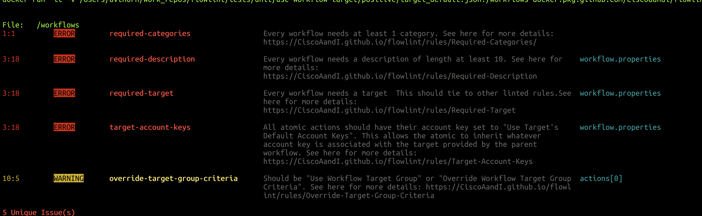

# Flowlint

Flowlint is a [Cisco SecureX Orchestrator](securex.cisco.com) workflow linter for secureX workflows, atomic actions, and subworkflows. It contains several best practices for linting workflows based on a set of common-sense and learned rules.

# Example

# Installation & Usage

    docker run -it -v <PATH TO WORKFLOW.JSON FILE TO LINT>:/workflow.json docker.pkg.github.com/ciscoaandi/flowlint/flowlint:1.0.0 /workflow.json

For example:

    docker run -it -v my_workflow.json:/workflow.json docker.pkg.github.com/ciscoaandi/flowlint/flowlint:1.0.0 /workflow.json

# Documentation

See our [Documentation Server](https://github.com/pages/CiscoAandI/flowlint) for more information.